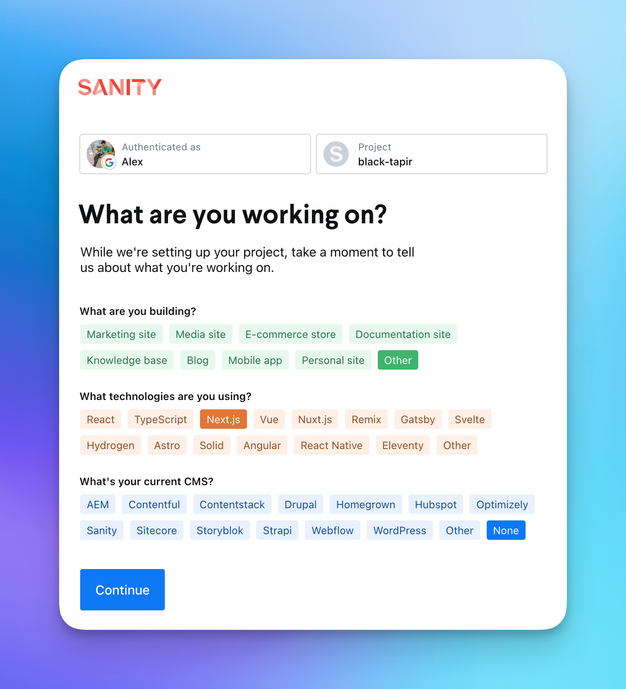
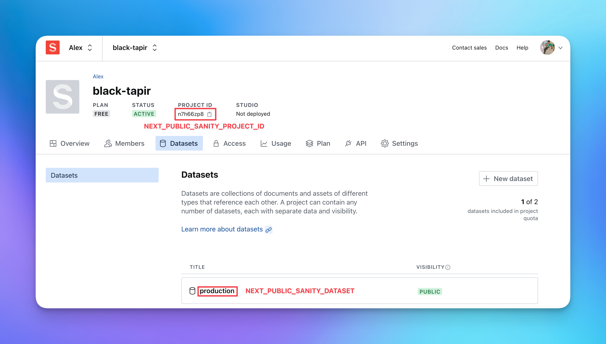

# Zolplay Official Website

## Introduction

This repo contains the code for the official website of Zolplay.

- [English (zolplay.com)](https://zolplay.com)
- [简体中文 (zolplay.cn)](https://zolplay.cn)

## Tech Stack

- [Next.js 13 (app router)](https://nextjs.org/)
- [TypeScript](https://www.typescriptlang.org/)
- [Tailwind CSS](https://tailwindcss.com/)
- [Framer Motion](https://www.framer.com/motion/)
- [Sanity.io](https://www.sanity.io/)
- [pnpm](https://pnpm.io/)

## Set up local environment

copy `.env.example` -> `.env`

```env
NEXT_PUBLIC_OG_URL=http://localhost:3000/api/og
```

### Set up sanity environment

Go to https://www.sanity.io/get-started/create-project and create a project, like this:



You can then go into the project and get sanity's two environment variables and add them to `.env`


Finally run these commands to run the project:

```bash
pnpm i
pnpm dev
```
